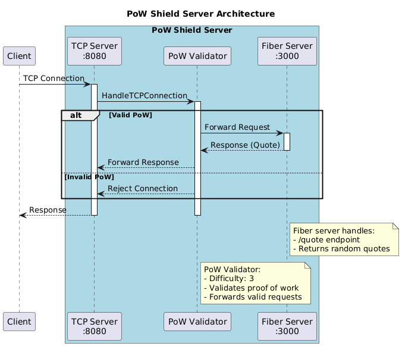

# PoW Shield

## Overview

PoW Shield is a proof-of-work based rate limiting service that helps protect APIs from abuse and DDoS attacks. It uses the Scrypt algorithm for proof-of-work verification.

The service requires clients to solve a computational puzzle before accessing protected endpoints. This creates a computational cost for each request, effectively deterring automated attacks while allowing legitimate traffic through.

### Architecture



### Why Scrypt?

[Scrypt Wikipedia](https://ru.wikipedia.org/wiki/Scrypt)

Scrypt was chosen as the proof-of-work algorithm because:

- It is designed to be computationally expensive and memory-intensive
- It is configurable and allows to tune the difficulty flexibly
- Makes it much harder to solve quickly on specialized hardware like GPUs or ASICs
- Provides strong protection against parallel brute-force attacks
- Well-tested and cryptographically secure

## Getting Started

### Prerequisites

- Docker
- Docker Compose

### Building and Running with Docker Compose

```bash
docker-compose up --build
```

## Usage

Protected endpoints will require a valid proof-of-work solution in the request headers. See the API documentation for details on implementing client-side proof-of-work calculations.
